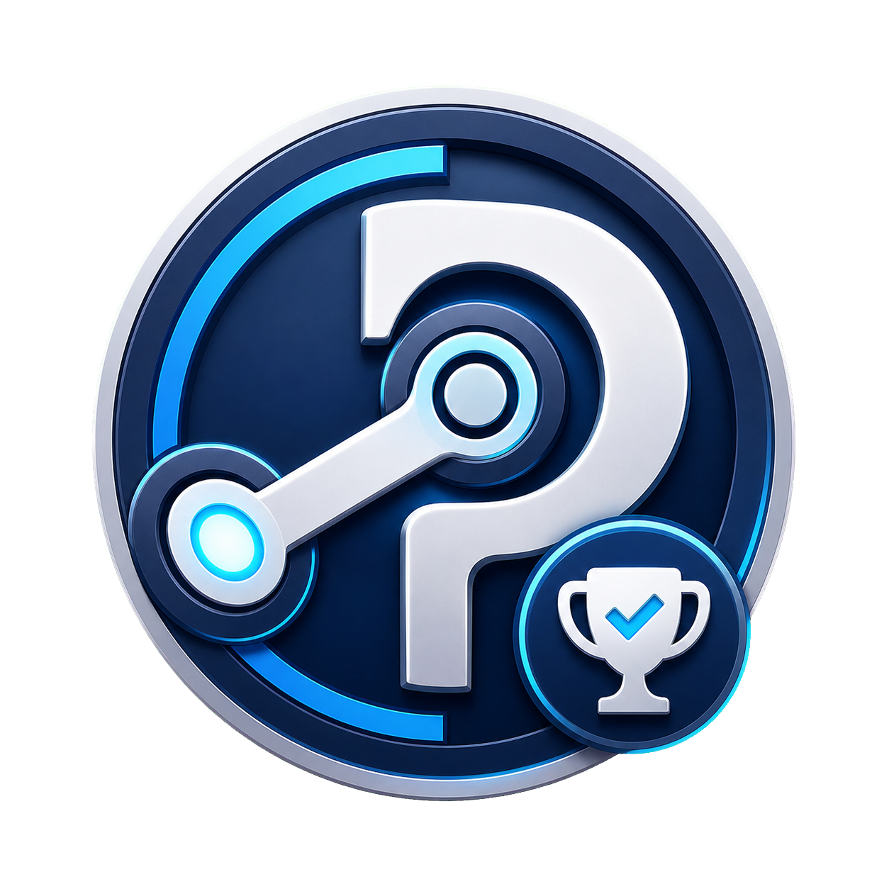

# MY SAM

<p align="center">
  
</p>

Компактний десктоп-менеджер досягнень та ігрової статистики Steam для Windows.

## Що вміє

- Знаходить локальну інсталяцію Steam та визначає, чи запущений `steam.exe`.
- Читає список встановлених ігор зі Steam-маніфестів бібліотек.
- Відкриває будь-яку вибрану гру через Steamworks за AppID.
- Показує список досягнень з чекбоксами.
- Розблоковує або блокує досягнення і одразу викликає `StoreStats`.
- Використовує локальну кешовану схему статистики Steam, з фолбеком на Steam Web API.
- Показує і дозволяє редагувати цілочисельні статистики, якщо схема містить імена.

## Вимоги

- Windows.
- Запущений Steam-клієнт із залогіненим акаунтом.

## Встановлення

Завантаж останню збірку зі [**сторінки релізів**](https://github.com/CpPrice11/steam-achievement-manager/releases/latest):

- **`SteamAchievementManager-vX.Y.Z-setup.exe`** — one-click інсталятор для поточного користувача. Створює ярлик у меню Пуск і видаляється через "Програми та компоненти". Рекомендовано для більшості користувачів.
- **`SteamAchievementManager-vX.Y.Z-portable.exe`** — портативна версія без встановлення.

Обидві збірки самодостатні і не потребують Node.js, npm чи будь-яких інших залежностей.

## Збірка з вихідного коду

Для розробки або самостійної збірки виконуваного файлу потрібні Node.js та npm.

```powershell
npm install
npm run start    # запуск у режимі розробки
npm run dist     # збірка NSIS-інсталятора у Setup/ та portable у Portable/
```

## Структура коду

```text
v0.1/
├─ main.js, preload.js       Electron entrypoints та IPC
├─ renderer.js, index.html   інтерфейс
├─ styles.css                стилі інтерфейсу
├─ domain/                   чиста логіка станів, DLC і діагностики
├─ steam/                    Steam library, Store, schema, worker і native helper
├─ tests/                    unit tests
└─ assets/                   іконки застосунку
```

## Примітки

Зміни досягнень використовують локальний Steamworks API. Steam документує `SetAchievement`, `ClearAchievement` та `StoreStats` як виклики статистики/досягнень для поточного користувача та поточної гри. Деякі ігри або спільноти можуть не схвалювати ручні зміни досягнень/статистики, тож використовуй це лише на власному акаунті та на власний ризик.

Для досягнень і статистики потрібні дані схеми, щоб програма знала API-імена. Спершу програма читає локальні файли Steam `appcache\stats\UserGameStatsSchema_<appid>.bin`. Якщо локальний кеш відсутній, а Steam Web API не повертає схему без ключа, додай свій Steam Web API ключ у налаштуваннях програми. Поточна npm-версія `steamworks.js` підтримує цілочисельну статистику, але не надає методів для float-статистики.

## Кредити

Натхнено [gibbed/SteamAchievementManager](https://github.com/gibbed/SteamAchievementManager) — оригінальний Steam Achievement Manager (SAM) від Rick Gibbed, написаний на C#. MY SAM — це незалежна реалізація на JavaScript / Electron, яка не містить коду оригіналу; вона лише запозичує ідею та назву SAM. Усі заслуги за оригінальну концепцію належать Rick Gibbed.

## Ліцензія

[MIT](LICENSE)
